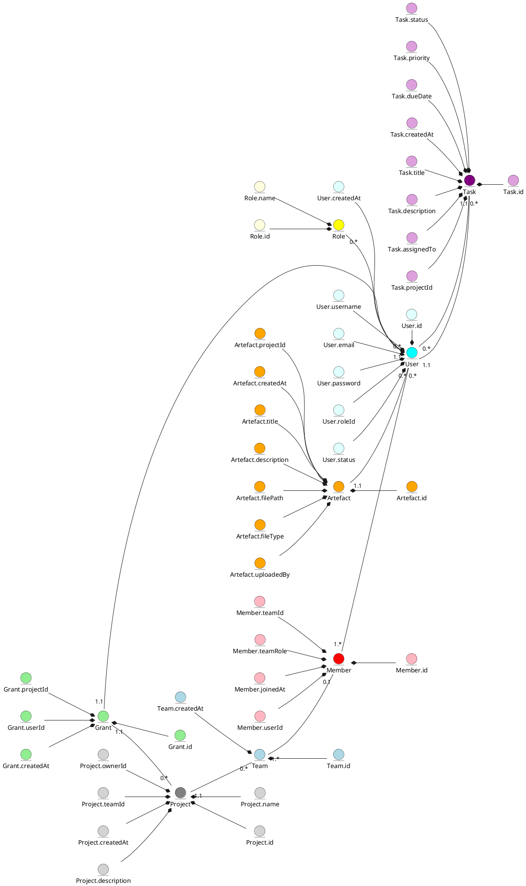
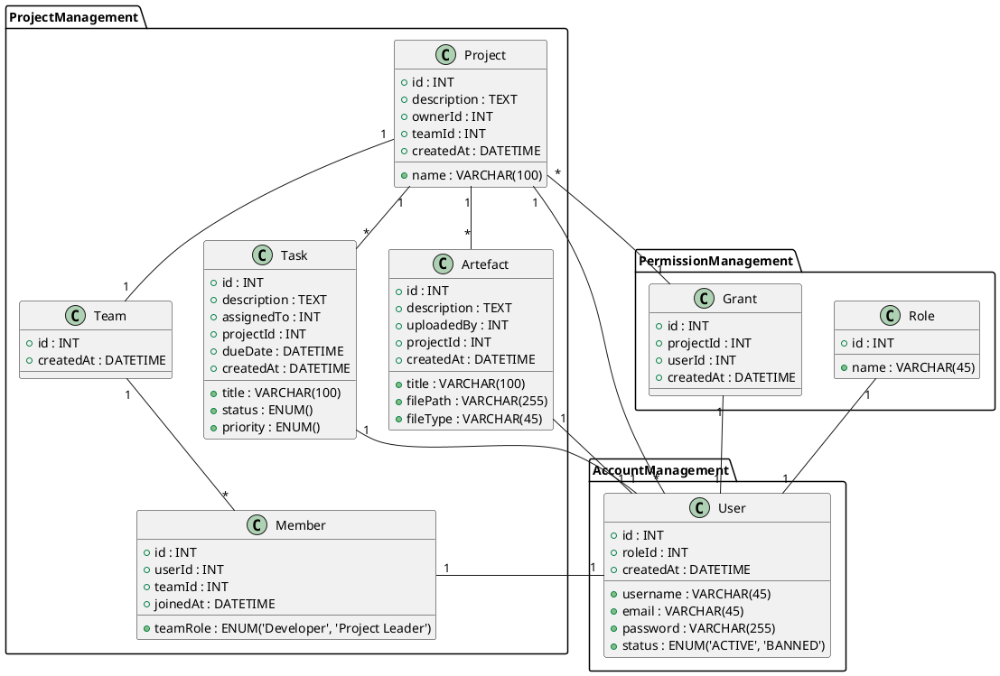
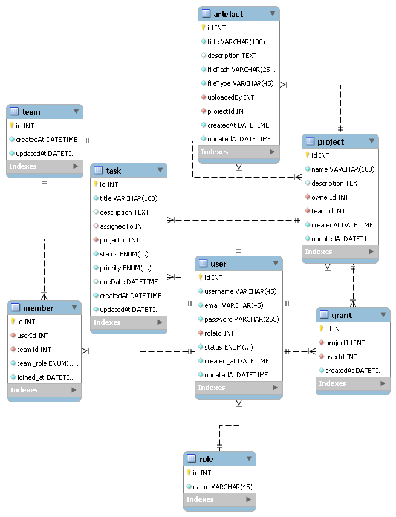

# Проєктування бази даних

## Модель бізнес об'єктів

```plantuml
@startuml
left to right direction
entity User #cyan
entity User.id #lightCyan
entity User.username #lightCyan
entity User.email #lightCyan
entity User.password #lightCyan
entity User.roleId #lightCyan
entity User.status #lightCyan
entity User.createdAt #lightCyan

User.id -r-* User
User.username --* User
User.email --* User
User.password --* User
User.roleId --* User
User.status --* User
User.createdAt --* User

entity Role #yellow
entity Role.id #lightYellow
entity Role.name #lightYellow

Role.id --* Role
Role.name --* Role

entity Project #gray
entity Project.id #lightGray
entity Project.name #lightGray
entity Project.description #lightGray
entity Project.ownerId #lightGray
entity Project.teamId #lightGray
entity Project.createdAt #lightGray

Project.id -u-* Project
Project.name -u-* Project
Project.description --* Project
Project.ownerId --* Project
Project.teamId --* Project
Project.createdAt --* Project

entity Team #lightBlue
entity Team.id #lightBlue
entity Team.createdAt #lightBlue

Team.id -u-* Team
Team.createdAt --* Team

entity Member #red
entity Member.id #lightPink
entity Member.userId #lightPink
entity Member.teamId #lightPink
entity Member.teamRole #lightPink
entity Member.joinedAt #lightPink

Member.id -u-* Member
Member.userId --* Member
Member.teamId --* Member
Member.teamRole --* Member
Member.joinedAt --* Member

entity Task #purple
entity Task.id #plum
entity Task.title #plum
entity Task.description #plum
entity Task.assignedTo #plum
entity Task.projectId #plum
entity Task.status #plum
entity Task.priority #plum
entity Task.dueDate #plum
entity Task.createdAt #plum

Task.id -u-* Task
Task.title --* Task
Task.description --* Task
Task.assignedTo --* Task
Task.projectId --* Task
Task.status --* Task
Task.priority --* Task
Task.dueDate --* Task
Task.createdAt --* Task

entity Artefact #orange
entity Artefact.id #orange
entity Artefact.title #orange
entity Artefact.description #orange
entity Artefact.filePath #orange
entity Artefact.fileType #orange
entity Artefact.uploadedBy #orange
entity Artefact.projectId #orange
entity Artefact.createdAt #orange

Artefact.id -u-* Artefact
Artefact.title --* Artefact
Artefact.description --* Artefact
Artefact.filePath --* Artefact
Artefact.fileType --* Artefact
Artefact.uploadedBy --* Artefact
Artefact.projectId --* Artefact
Artefact.createdAt --* Artefact

entity Grant #lightGreen
entity Grant.id #lightGreen
entity Grant.projectId #lightGreen
entity Grant.userId #lightGreen
entity Grant.createdAt #lightGreen

Grant.id -u-* Grant
Grant.projectId --* Grant
Grant.userId --* Grant
Grant.createdAt --* Grant

User "1.1" -u- "0.*" Role
User "1.1" -- "0.*" Task
Project "1.1" -- "0.*" Team
Team "1.*" -- "0.1" Member
Member "1.*" -- "0.*" User
Task "1.1" -- "0.*" User
Artefact "1.1" -- "0.*" User
Grant "1.1" -- "0.*" User
Grant "1.1" -- "0.*" Project

@enduml
```
## ER-модель

```plantuml
@startuml

package AccountManagement {
    class User {
        +id : INT
        +username : VARCHAR(45)
        +email : VARCHAR(45)
        +password : VARCHAR(255)
        +roleId : INT
        +status : ENUM('ACTIVE', 'BANNED')
        +createdAt : DATETIME
    }
}

package ProjectManagement {
    class Project {
        +id : INT
        +name : VARCHAR(100)
        +description : TEXT
        +ownerId : INT
        +teamId : INT
        +createdAt : DATETIME
    }

    class Team {
        +id : INT
        +createdAt : DATETIME
    }

    class Member {
        +id : INT
        +userId : INT
        +teamId : INT
        +teamRole : ENUM('Developer', 'Project Leader')
        +joinedAt : DATETIME
    }

    class Task {
        +id : INT
        +title : VARCHAR(100)
        +description : TEXT
        +assignedTo : INT
        +projectId : INT
        +status : ENUM()
        +priority : ENUM()
        +dueDate : DATETIME
        +createdAt : DATETIME
    }

    class Artefact {
        +id : INT
        +title : VARCHAR(100)
        +description : TEXT
        +filePath : VARCHAR(255)
        +fileType : VARCHAR(45)
        +uploadedBy : INT
        +projectId : INT
        +createdAt : DATETIME
    }

    Project "1" -- "*" Task
    Project "1" -- "*" Artefact
    Project "1" -- "1" Team
    Team "1" -- "*" Member
    Member "1" -- "1" User
    Task "1" -- "1" User
    Artefact "1" -- "1" User
    Project "1" -- "*" User
}

package PermissionManagement {
    class Role {
        +id : INT
        +name : VARCHAR(45)
    }

    class Grant {
        +id : INT
        +projectId : INT
        +userId : INT
        +createdAt : DATETIME
    }

    Grant "1" -- "*" Project
    Grant "1" -- "1" User
    User "1" -- "1" Role
}

@enduml
```
## Реляційна схема

