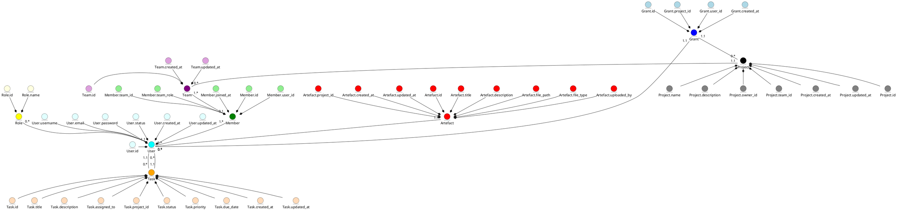

# Проєктування бази даних
##Модель бізнес об'єктів

```plantuml
@startuml

entity User #cyan
entity User.id #lightCyan
entity User.username #lightCyan
entity User.email #lightCyan
entity User.password #lightCyan
entity User.status #lightCyan
entity User.created_at #lightCyan
entity User.updated_at #lightCyan

User.id -r-* User
User.username --* User
User.email --* User
User.password --* User
User.status --* User
User.created_at --* User
User.updated_at --* User

entity Role #yellow
entity Role.id #lightYellow
entity Role.name #lightYellow

Role.id --* Role
Role.name --* Role

entity Project #black
entity Project.id #gray
entity Project.name #gray
entity Project.description #gray
entity Project.owner_id #gray
entity Project.team_id #gray
entity Project.created_at #gray
entity Project.updated_at #gray

Project.id -u-* Project
Project.name -u-* Project
Project.description -u-* Project
Project.owner_id -u-* Project
Project.team_id -u-* Project
Project.created_at -u-* Project
Project.updated_at -u-* Project

entity Team #purple
entity Team.id #plum
entity Team.created_at #plum
entity Team.updated_at #plum

Team.id -r-* Team
Team.created_at --* Team
Team.updated_at --* Team

entity Member #green
entity Member.id #lightGreen
entity Member.user_id #lightGreen
entity Member.team_id #lightGreen
entity Member.team_role #lightGreen
entity Member.joined_at #lightGreen

Member.id --* Member
Member.user_id --* Member
Member.team_id --* Member
Member.team_role --* Member
Member.joined_at --* Member

entity Task #orange
entity Task.id #peachPuff
entity Task.title #peachPuff
entity Task.description #peachPuff
entity Task.assigned_to #peachPuff
entity Task.project_id #peachPuff
entity Task.status #peachPuff
entity Task.priority #peachPuff
entity Task.due_date #peachPuff
entity Task.created_at #peachPuff
entity Task.updated_at #peachPuff

Task.id -u-* Task
Task.title -u-* Task
Task.description -u-* Task
Task.assigned_to -u-* Task
Task.project_id -u-* Task
Task.status -u-* Task
Task.priority -u-* Task
Task.due_date -u-* Task
Task.created_at -u-* Task
Task.updated_at -u-* Task

entity Artefact #red
entity Artefact.id #red
entity Artefact.title #red
entity Artefact.description #red
entity Artefact.file_path #red
entity Artefact.file_type #red
entity Artefact.uploaded_by #red
entity Artefact.project_id #red
entity Artefact.created_at #red
entity Artefact.updated_at #red

Artefact.id --* Artefact
Artefact.title --* Artefact
Artefact.description --* Artefact
Artefact.file_path --* Artefact
Artefact.file_type --* Artefact
Artefact.uploaded_by --* Artefact
Artefact.project_id --* Artefact
Artefact.created_at --* Artefact
Artefact.updated_at --* Artefact

entity Grant #blue
entity Grant.id #lightBlue
entity Grant.project_id #lightBlue
entity Grant.user_id #lightBlue
entity Grant.created_at #lightBlue

Grant.id --* Grant
Grant.project_id --* Grant
Grant.user_id --* Grant
Grant.created_at --* Grant

User "1.1" -u- "0.*" Role
User "1.1" -- "0.*" Task
Project "1.1" -- "0.*" Team
Team "1.*" -- "0.1" Member
Member "1.*" -- "0.*" User
Task "1.1" -- "0.*" User
Artefact "1.1" -- "0.*" User
Grant "1.1" -- "0.*" User
Grant "1.1" -- "0.*" Project

@enduml

```

В рамках проекту розробляється: 

- ER-модель
- реляційна схема

