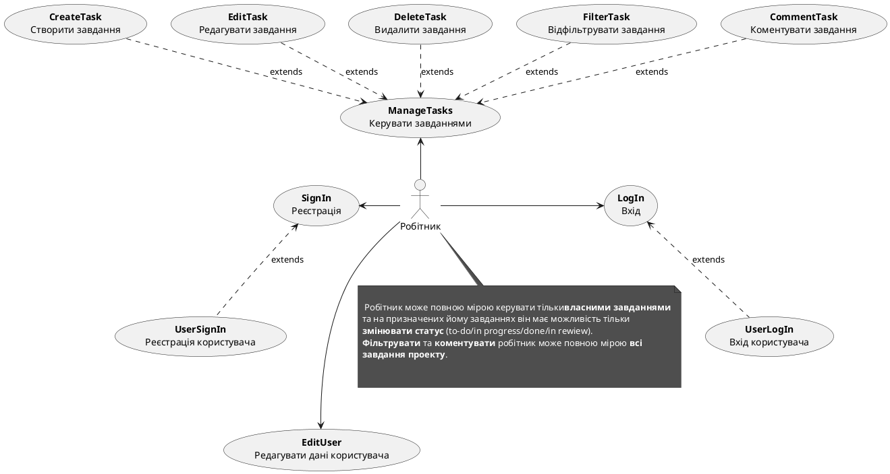
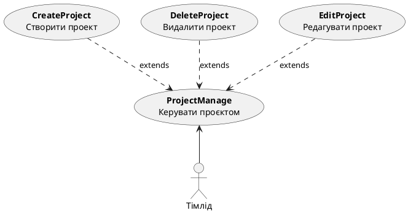
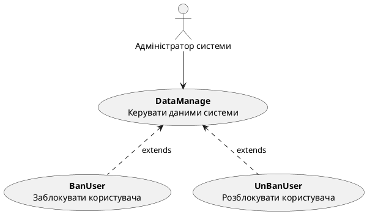

# Розроблення функціональних вимог до системи

## Загальна схема

```plantuml

@startuml
skinparam noteFontColor white

actor "Робітник" as Collaborator


usecase "<b>SignIn</b>\nЗареєструватися" as SignIn
usecase "<b>Login</b>\nВвхід у систему" as Login
usecase "<b>ManageTasks</b>\nУправління завданнями" as ManageTasks
usecase "<b>EditUser</b>\nРедагування даних користувача" as EditUser


Collaborator -r-> SignIn
Collaborator -u-> Login
Collaborator -l-> ManageTasks
Collaborator -u-> EditUser


note bottom of Collaborator  #4e4e4e

   Робітник може повною мірою керувати тільки<b>власними завданнями</b>
   та на призначених йому завданнях він має можливість тільки
   <b>змінювати статус</b> (to-do/in progress/done/in rewiew).
   <b>Фільтрувати</b> та <b>коментувати</b> робітник може повною мірою <b>всі</b>
   <b>завдання проекту</b>.
   

end note

actor "Тімлід" as Teamlead

usecase "<b>ProjectManage</b>\nКерувати проектом" as ProjectManage


Teamlead -> ProjectManage
Teamlead -u-|> Collaborator

actor "Адміністратор системи" as Admin

usecase "<b>DataManage</b>\nКерувати даними системи" as DataManage


Admin --> DataManage

Admin -u-|> Teamlead
@enduml

```

## Робітник

```plantuml
@startuml
skinparam noteFontColor white

actor "Робітник" as Collaborator

usecase "<b>SignIn</b>\nРеєстрація" as SignIn
usecase "<b>UserSignIn</b>\nРеєстрація користувача" as UserSignIn
usecase "<b>LogIn</b>\nВхід" as Login
usecase "<b>UserLogIn</b>\nВхід користувача" as UserLogIn
usecase "<b>EditUser</b>\nРедагувати дані користувача" as EditUser
usecase "<b>ManageTasks</b>\nКерувати завданнями" as ManageTasks
usecase "<b>CreateTask</b>\nСтворити завдання" as CreateTask
usecase "<b>EditTask</b>\nРедагувати завдання" as EditTask
usecase "<b>DeleteTask</b>\nВидалити завдання" as DeleteTask
usecase "<b>FilterTask</b>\nВідфільтрувати завдання" as FilterTask
usecase "<b>CommentTask</b>\nКоментувати завдання" as CommentTask

Collaborator -l-> SignIn
SignIn <.d. UserSignIn:extends
Collaborator -r-> Login
Login <.d. UserLogIn:extends
Collaborator --d-> EditUser
Collaborator -u-> ManageTasks
ManageTasks <.u. CommentTask:extends
ManageTasks <.u. FilterTask:extends
ManageTasks <.u. DeleteTask:extends
ManageTasks <.u. EditTask:extends
ManageTasks<.u. CreateTask:extends

note bottom of Collaborator #4e4e4e

    Робітник може повною мірою керувати тільки<b>власними завданнями</b>
   та на призначених йому завданнях він має можливість тільки
   <b>змінювати статус</b> (to-do/in progress/done/in rewiew).
   <b>Фільтрувати</b> та <b>коментувати</b> робітник може повною мірою <b>всі</b>
   <b>завдання проекту</b>.
   

end note
@enduml

```
## Тімлід

```plantuml
@startuml
top to bottom direction

actor "Тімлід" as Lead

usecase "<b>CreateProject</b>\nСтворити проект" as CreateProject
usecase "<b>DeleteProject</b>\nВидалити проект" as DeleteProject
usecase "<b>EditProject</b>\nРедагувати проект" as EditProject
usecase "<b>ProjectManage</b>\nКерувати проєктом" as ProjectManage

CreateProject .d.> ProjectManage: extends
DeleteProject .d.> ProjectManage: extends
EditProject .d.> ProjectManage: extends

Lead -u-> ProjectManage
@enduml
```
## Адміністратор

```plantuml
@startuml
actor "Адміністратор системи" as Admin
usecase "<b>DataManage</b>\nКерувати даними системи" as DataManage
usecase "<b>BanUser</b>\nЗаблокувати користувача" as BanUser
usecase "<b>UnBanUser</b>\nРозблокувати користувача" as UnBanUser

Admin -d-> DataManage
BanUser .u.> DataManage:extends
UnBanUser .u.> DataManage:extends
@enduml
```
## Сценарії

