# Розроблення функціональних вимог до системи

## Загальна схема
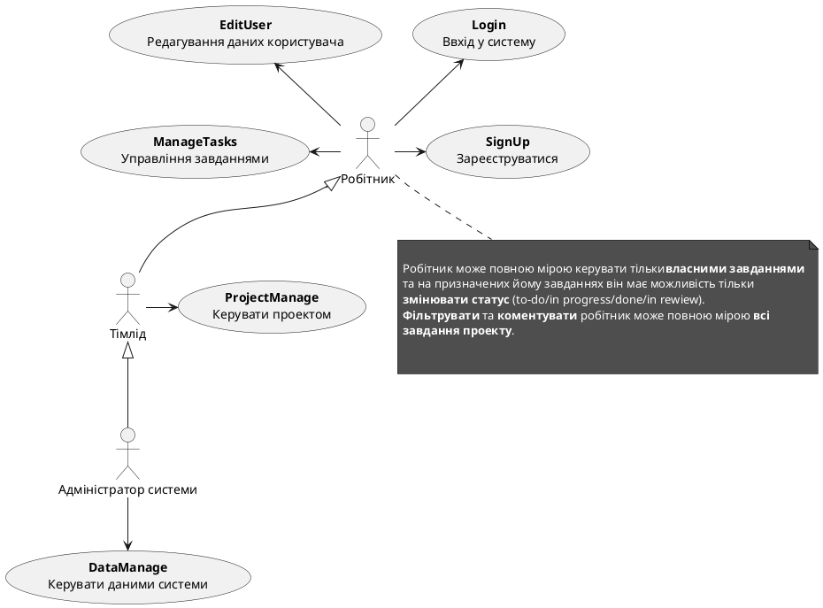

## Робітник

## Тімлід
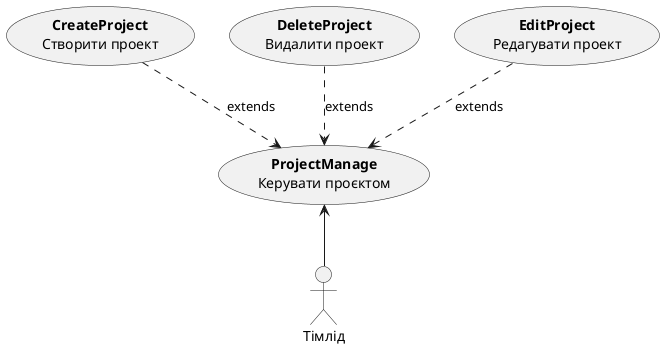
## Адміністратор
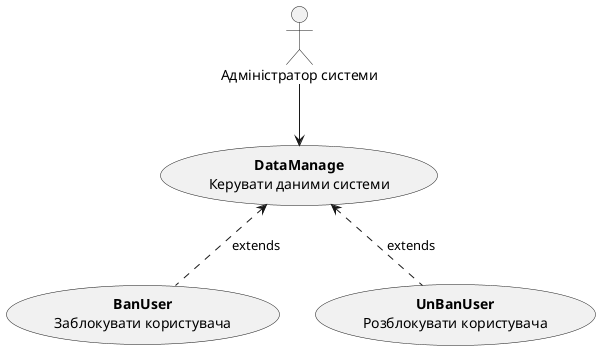
## Сценерії 

<table>
    <tr>
        <th>ID</th>
        <th id="EditUser"><code>EditUser</code></th>
    </tr>
    <tr>
        <th>Назва</th>
        <td>Редагувати користувача</td>
    </tr>
    <tr>
        <th>Учасники</th>
        <td>Користувач, адміністратор,система</td>
    </tr>
    <tr>
        <th>Передумови</th>
        <td>Користувач ввійшов до системи</td>
    </tr>
    <tr>
        <th>Результат</th>
        <td>Користувача успішно відредаговано</td>
    </tr>
    <tr>
        <th>Виключні ситуації</th>
        <td>
            <ul>
                <li>Користувача не знайдено (UserNotFoundException)</li>
                <li>Недостатні права для редагування (InsufficientPermissionsException)</li>
                <li>Введені дані некоректні (InvalidDataException)</li>
            </ul>
        </td>
    </tr>
    <tr>
        <th>Основний сценарій</th>
        <td>
            <ol>
                <li>Користувач вносить зміни в дані.</li>
                <li>Система перевіряє коректність введених даних (можливе InvalidDataException).</li>
                <li>Система зберігає зміни в даних користувача.</li>
            </ol>
        </td>
    </tr>
</table>

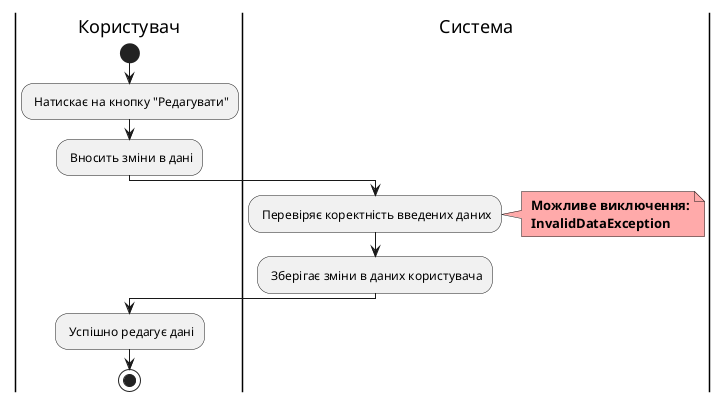

 
<table>
    <tr>
        <th>ID</th>
        <th id="UserSignUp"><code>UserSignUp</code></th>
    </tr>
    <tr>
        <th>Назва</th>
        <td>Реєстрація користувача</td>
    </tr>
    <tr>
        <th>Учасники</th>
        <td>Користувач, система</td>
    </tr>
    <tr>
        <th>Передумови</th>
        <td>Користувач не зареєстрований у системі</td>
    </tr>
    <tr>
        <th>Результат</th>
        <td>Користувача успішно зареєстровано</td>
    </tr>
    <tr>
        <th>Виключні ситуації</th>
        <td>
            <ul>
                <li>Користувач вже існує (UserAlreadyExistsException)</li>
                <li>Недостатні дані (InsufficientDataException)</li>
                <li>Введені дані некоректні (InvalidDataException)</li>
            </ul>
        </td>
    </tr>
    <tr>
        <th>Основний сценарій</th>
        <td>
            <ol>
                <li>Користувач заповнює форму реєстрації.</li>
                <li>Система перевіряє введені дані (можливе InvalidDataException або InsufficientDataException).</li>
                <li>Система перевіряє, чи користувач вже існує (можливе UserAlreadyExistsException).</li>
                <li>Користувача успішно реєструють у системі.</li>
            </ol>
        </td>
    </tr>
</table>

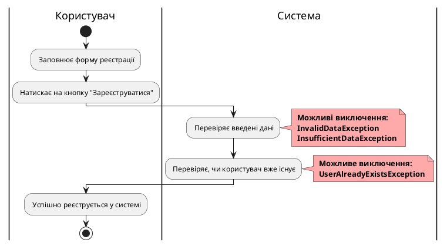

 
<table>
    <tr>
        <th>ID</th>
        <th id="UserLogIn"><code>UserLogIn</code></th>
    </tr>
    <tr>
        <th>Назва</th>
        <td>Вхід користувача</td>
    </tr>
    <tr>
        <th>Учасники</th>
        <td>Користувач, система</td>
    </tr>
    <tr>
        <th>Передумови</th>
        <td>Користувач зареєстрований у системі</td>
    </tr>
    <tr>
        <th>Результат</th>
        <td>Користувача успішно авторизовано</td>
    </tr>
    <tr>
        <th>Виключні ситуації</th>
        <td>
            <ul>
                <li>Користувач ввів неправильне ім'я користувача (InvalidUsernameException)</li>
                <li>Користувач ввів неправильний пароль (InvalidPasswordException)</li>
                <li>Користувач заблокований (UserBannedException)</li>
            </ul>
        </td>
    </tr>
    <tr>
        <th>Основний сценарій</th>
        <td>
            <ol>
                <li>Користувач вводить ім'я користувача і пароль.</li>
                <li>Користувач натискає на кнопку "Увійти".</li>
                <li>Система перевіряє введені дані (можливе InvalidUsernameException або InvalidPasswordException).</li>
                <li>Система перевіряє статус користувача (можливе UserBannedException).</li>
                <li>Користувача успішно авторизують у системі.</li>
            </ol>
        </td>
    </tr>
</table>

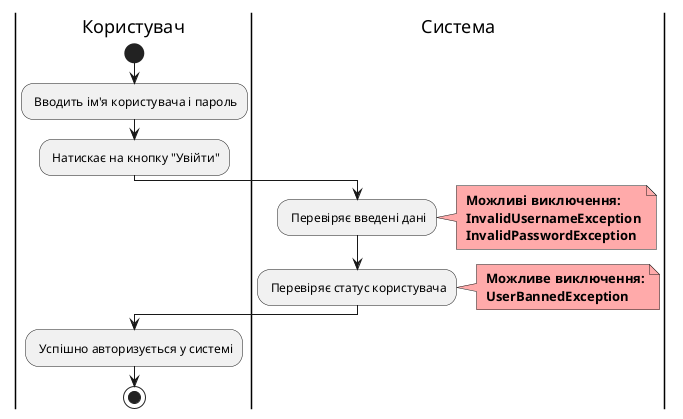

 
 
<table>
    <tr>
        <th>ID</th>
        <th id="CreateTask"><code>CreateTask</code></th>
    </tr>
    <tr>
        <th>Назва</th>
        <td>Створення задачі</td>
    </tr>
    <tr>
        <th>Учасники</th>
        <td>Користувач, система</td>
    </tr>
    <tr>
        <th>Передумови</th>
        <td>Користувач увійшов до системи</td>
    </tr>
    <tr>
        <th>Результат</th>
        <td>Задача успішно створена</td>
    </tr>
    <tr>
        <th>Виключні ситуації</th>
        <td>
            <ul>
                <li>Недостатні дані для створення задачі (InsufficientDataException)</li>
                <li>Задача з таким же ідентифікатором вже існує (TaskAlreadyExistsException)</li>
                <li>Недостатні права для створення задачі (InsufficientPermissionsException)</li>
            </ul>
        </td>
    </tr>
    <tr>
        <th>Основний сценарій</th>
        <td>
            <ol>
                <li>Користувач заповнює форму створення задачі.</li>
                <li>Користувач натискає на кнопку "Створити задачу".</li>
                <li>Система перевіряє введені дані (можливе InsufficientDataException).</li>
                <li>Система перевіряє, чи існує задача з таким же ідентифікатором (можливе TaskAlreadyExistsException).</li>
                <li>Задача успішно створена у системі.</li>
            </ol>
        </td>
    </tr>
</table>

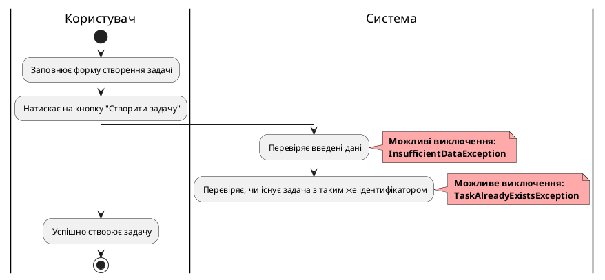

 
<table>
    <tr>
        <th>ID</th>
        <th id="EditTask"><code>EditTask</code></th>
    </tr>
    <tr>
        <th>Назва</th>
        <td>Редагування задачі</td>
    </tr>
    <tr>
        <th>Учасники</th>
        <td>Користувач, система</td>
    </tr>
    <tr>
        <th>Передумови</th>
        <td>Користувач увійшов до системи і має доступ до задачі</td>
    </tr>
    <tr>
        <th>Результат</th>
        <td>Задача успішно редагована</td>
    </tr>
    <tr>
        <th>Виключні ситуації</th>
        <td>
            <ul>
                <li>Недостатні дані для редагування задачі (InsufficientDataException)</li>
                <li>Задача не знайдена (TaskNotFoundException)</li>
                <li>Недостатні права для редагування задачі (InsufficientPermissionsException)</li>
            </ul>
        </td>
    </tr>
    <tr>
        <th>Основний сценарій</th>
        <td>
            <ol>
                <li>Користувач вибирає задачу для редагування.</li>
                <li>Користувач вносить зміни до задачі.</li>
                <li>Користувач натискає на кнопку "Зберегти зміни".</li>
                <li>Система перевіряє введені дані (можливе InsufficientDataException).</li>
                <li>Система перевіряє, чи існує задача (можливе TaskNotFoundException).</li>
                <li>Задача успішно редагована у системі.</li>
            </ol>
        </td>
    </tr>
</table>

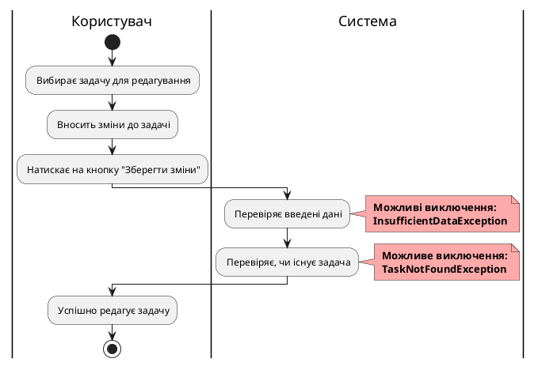

 
 
<table>
    <tr>
        <th>ID</th>
        <th id="DeleteTask"><code>DeleteTask</code></th>
    </tr>
    <tr>
        <th>Назва</th>
        <td>Видалення задачі</td>
    </tr>
    <tr>
        <th>Учасники</th>
        <td>Користувач, система</td>
    </tr>
    <tr>
        <th>Передумови</th>
        <td>Користувач увійшов до системи і має доступ до задачі</td>
    </tr>
    <tr>
        <th>Результат</th>
        <td>Задача успішно видалена</td>
    </tr>
    <tr>
        <th>Виключні ситуації</th>
        <td>
            <ul>
                <li>Задача не знайдена (TaskNotFoundException)</li>
                <li>Недостатні права для видалення задачі (InsufficientPermissionsException)</li>
            </ul>
        </td>
    </tr>
    <tr>
        <th>Основний сценарій</th>
        <td>
            <ol>
                <li>Користувач вибирає задачу для видалення.</li>
                <li>Користувач підтверджує видалення задачі.</li>
                <li>Система перевіряє, чи існує задача (можливе TaskNotFoundException).</li>
                <li>Задача успішно видалена з системи.</li>
            </ol>
        </td>
    </tr>
</table>

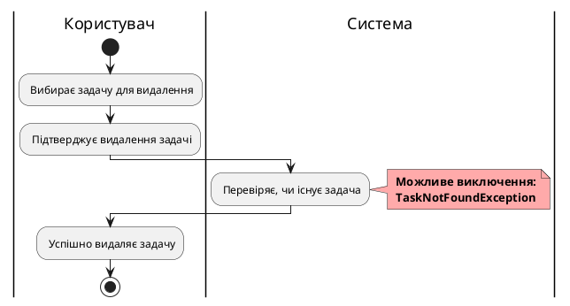

 
 
<table>
    <tr>
        <th>ID</th>
        <th id="FilterTask"><code>FilterTask</code></th>
    </tr>
    <tr>
        <th>Назва</th>
        <td>Фільтрація задач</td>
    </tr>
    <tr>
        <th>Учасники</th>
        <td>Користувач, система</td>
    </tr>
    <tr>
        <th>Передумови</th>
        <td>Користувач увійшов до системи та має доступ до списку задач</td>
    </tr>
    <tr>
        <th>Результат</th>
        <td>Система відображає відфільтрований список задач</td>
    </tr>
    <tr>
        <th>Виключні ситуації</th>
        <td>
            <ul>
                <li>Немає задач, що відповідають критеріям фільтрації (NoTasksFoundException)</li>
            </ul>
        </td>
    </tr>
    <tr>
        <th>Основний сценарій</th>
        <td>
            <ol>
                <li>Користувач вводить критерії фільтрації.</li>
                <li>Користувач натискає на кнопку "Фільтрувати".</li>
                <li>Система обробляє запит на фільтрацію.</li>
                <li>Система перевіряє наявність задач, що відповідають критеріям (можливе NoTasksFoundException).</li>
                <li>Система відображає відфільтрований список задач.</li>
            </ol>
        </td>
    </tr>
</table>

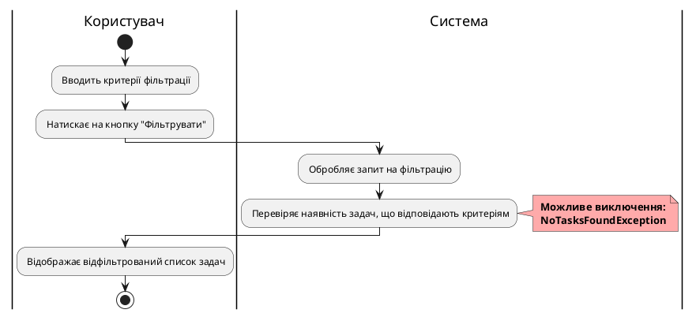

 
<table>
    <tr>
        <th>ID</th>
        <th id="CommentTask"><code>CommentTask</code></th>
    </tr>
    <tr>
        <th>Назва</th>
        <td>Додавання коментаря до задачі</td>
    </tr>
    <tr>
        <th>Учасники</th>
        <td>Користувач, система</td>
    </tr>
    <tr>
        <th>Передумови</th>
        <td>Користувач увійшов до системи і має доступ до задачі</td>
    </tr>
    <tr>
        <th>Результат</th>
        <td>Коментар успішно додано до задачі</td>
    </tr>
    <tr>
        <th>Виключні ситуації</th>
        <td>
            <ul>
                <li>Задача не знайдена (TaskNotFoundException)</li>
                <li>Недостатні права для додавання коментаря (InsufficientPermissionsException)</li>
            </ul>
        </td>
    </tr>
    <tr>
        <th>Основний сценарій</th>
        <td>
            <ol>
                <li>Користувач вибирає задачу, до якої хоче додати коментар.</li>
                <li>Користувач вводить текст коментаря.</li>
                <li>Користувач натискає на кнопку "Додати коментар".</li>
                <li>Система перевіряє, чи існує задача (можливе TaskNotFoundException).</li>
                <li>Система перевіряє права користувача на додавання коментаря (можливе InsufficientPermissionsException).</li>
                <li>Коментар успішно додано до задачі.</li>
            </ol>
        </td>
    </tr>
</table>

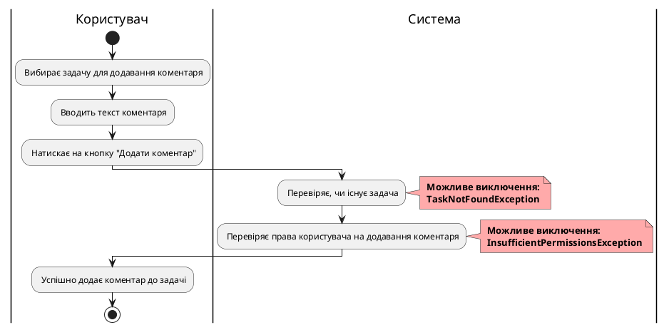

 
 
<table>
    <tr>
        <th>ID</th>
        <th id="CreateProject"><code>CreateProject</code></th>
    </tr>
    <tr>
        <th>Назва</th>
        <td>Створення проекту</td>
    </tr>
    <tr>
        <th>Учасники</th>
        <td>Тімлід, система</td>
    </tr>
    <tr>
        <th>Передумови</th>
        <td>Тімлід увійшов до системи</td>
    </tr>
    <tr>
        <th>Результат</th>
        <td>Проект успішно створено</td>
    </tr>
    <tr>
        <th>Виключні ситуації</th>
        <td>
            <ul>
                <li>Недостатні дані для створення проекту (InsufficientDataException)</li>
                <li>Проект з таким же ідентифікатором вже існує (ProjectAlreadyExistsException)</li>
                <li>Недостатні права для створення проекту (InsufficientPermissionsException)</li>
            </ul>
        </td>
    </tr>
    <tr>
        <th>Основний сценарій</th>
        <td>
            <ol>
                <li>Тімлід заповнює форму створення проекту.</li>
                <li>Тімлід натискає на кнопку "Створити проект".</li>
                <li>Система перевіряє введені дані (можливе InsufficientDataException).</li>
                <li>Система перевіряє, чи існує проект з таким же ідентифікатором (можливе ProjectAlreadyExistsException).</li>
                <li>Проект успішно створено у системі.</li>
            </ol>
        </td>
    </tr>
</table>

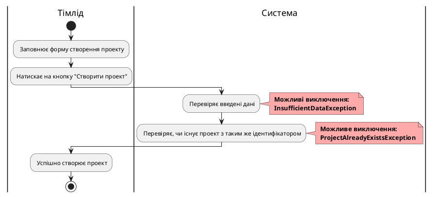

 
 
<table>
    <tr>
        <th>ID</th>
        <th id="EditProject"><code>EditProject</code></th>
    </tr>
    <tr>
        <th>Назва</th>
        <td>Редагування проекту</td>
    </tr>
    <tr>
        <th>Учасники</th>
        <td>Тімлід, система</td>
    </tr>
    <tr>
        <th>Передумови</th>
        <td>Тімлід увійшов до системи і має доступ до проекту</td>
    </tr>
    <tr>
        <th>Результат</th>
        <td>Проект успішно редаговано</td>
    </tr>
    <tr>
        <th>Виключні ситуації</th>
        <td>
            <ul>
                <li>Недостатні дані для редагування проекту (InsufficientDataException)</li>
                <li>Проект не знайдено (ProjectNotFoundException)</li>
                <li>Недостатні права для редагування проекту (InsufficientPermissionsException)</li>
            </ul>
        </td>
    </tr>
    <tr>
        <th>Основний сценарій</th>
        <td>
            <ol>
                <li>Тімлід вибирає проект для редагування.</li>
                <li>Тімлід вносить зміни до проекту.</li>
                <li>Тімлід натискає на кнопку "Зберегти зміни".</li>
                <li>Система перевіряє введені дані (можливе InsufficientDataException).</li>
                <li>Система перевіряє, чи існує проект (можливе ProjectNotFoundException).</li>
                <li>Проект успішно редаговано у системі.</li>
            </ol>
        </td>
    </tr>
</table>

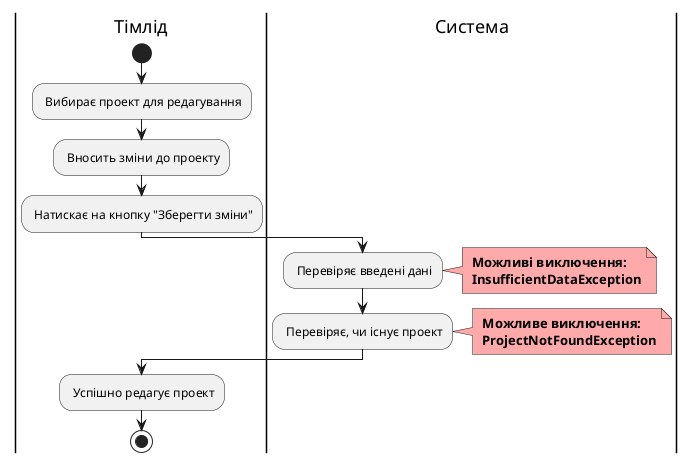

 
 
<table>
    <tr>
        <th>ID</th>
        <th id="DeleteProject"><code>DeleteProject</code></th>
    </tr>
    <tr>
        <th>Назва</th>
        <td>Видалення проекту</td>
    </tr>
    <tr>
        <th>Учасники</th>
        <td>Тімлід, система</td>
    </tr>
    <tr>
        <th>Передумови</th>
        <td>Тімлід увійшов до системи і має доступ до проекту</td>
    </tr>
    <tr>
        <th>Результат</th>
        <td>Проект успішно видалено</td>
    </tr>
    <tr>
        <th>Виключні ситуації</th>
        <td>
            <ul>
                <li>Проект не знайдено (ProjectNotFoundException)</li>
                <li>Недостатні права для видалення проекту (InsufficientPermissionsException)</li>
            </ul>
        </td>
    </tr>
    <tr>
        <th>Основний сценарій</th>
        <td>
            <ol>
                <li>Тімлід вибирає проект для видалення.</li>
                <li>Тімлід підтверджує видалення проекту.</li>
                <li>Система перевіряє, чи існує проект (можливе ProjectNotFoundException).</li>
                <li>Проект успішно видалено з системи.</li>
            </ol>
        </td>
    </tr>
</table>

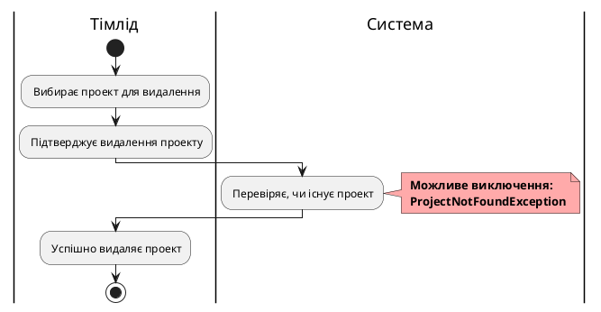

 
 
<table>
    <tr>
        <th>ID</th>
        <th id="BanUser"><code>BanUser</code></th>
    </tr>
    <tr>
        <th>Назва</th>
        <td>Блокування користувача</td>
    </tr>
    <tr>
        <th>Учасники</th>
        <td>Адміністратор, система</td>
    </tr>
    <tr>
        <th>Передумови</th>
        <td>Адміністратор увійшов до системи</td>
    </tr>
    <tr>
        <th>Результат</th>
        <td>Користувача успішно заблоковано</td>
    </tr>
    <tr>
        <th>Виключні ситуації</th>
        <td>
            <ul>
                <li>Користувача не знайдено (UserNotFoundException)</li>
                <li>Недостатні права для блокування користувача (InsufficientPermissionsException)</li>
            </ul>
        </td>
    </tr>
    <tr>
        <th>Основний сценарій</th>
        <td>
            <ol>
                <li>Адміністратор вибирає користувача для блокування.</li>
                <li>Адміністратор підтверджує блокування користувача.</li>
                <li>Система перевіряє, чи існує користувач (можливе UserNotFoundException).</li>
                <li>Користувача успішно заблоковано у системі.</li>
            </ol>
        </td>
    </tr>
</table>

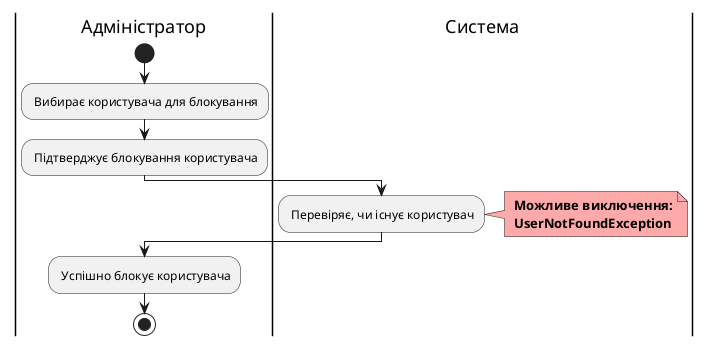

 
 
<table>
    <tr>
        <th>ID</th>
        <th id="UnbanUser"><code>UnbanUser</code></th>
    </tr>
    <tr>
        <th>Назва</th>
        <td>Розблокування користувача</td>
    </tr>
    <tr>
        <th>Учасники</th>
        <td>Адміністратор, система</td>
    </tr>
    <tr>
        <th>Передумови</th>
        <td>Адміністратор увійшов до системи</td>
    </tr>
    <tr>
        <th>Результат</th>
        <td>Користувача успішно розблоковано</td>
    </tr>
    <tr>
        <th>Виключні ситуації</th>
        <td>
            <ul>
                <li>Користувача не знайдено (UserNotFoundException)</li>
                <li>Користувач не заблокований (UserNotBannedException)</li>
                <li>Недостатні права для розблокування користувача (InsufficientPermissionsException)</li>
            </ul>
        </td>
    </tr>
    <tr>
        <th>Основний сценарій</th>
        <td>
            <ol>
                <li>Адміністратор вибирає користувача для розблокування.</li>
                <li>Адміністратор підтверджує розблокування користувача.</li>
                <li>Система перевіряє, чи існує користувач (можливе UserNotFoundException).</li>
                <li>Система перевіряє, чи користувач заблокований (можливе UserNotBannedException).</li>
                <li>Користувача успішно розблоковано у системі.</li>
            </ol>
        </td>
    </tr>
</table>

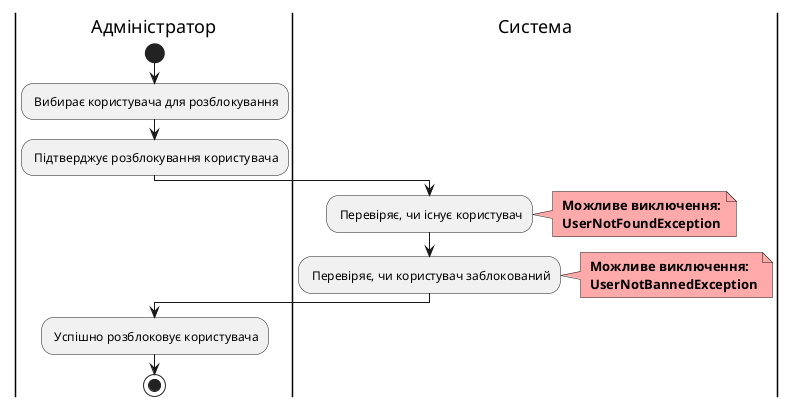

 
